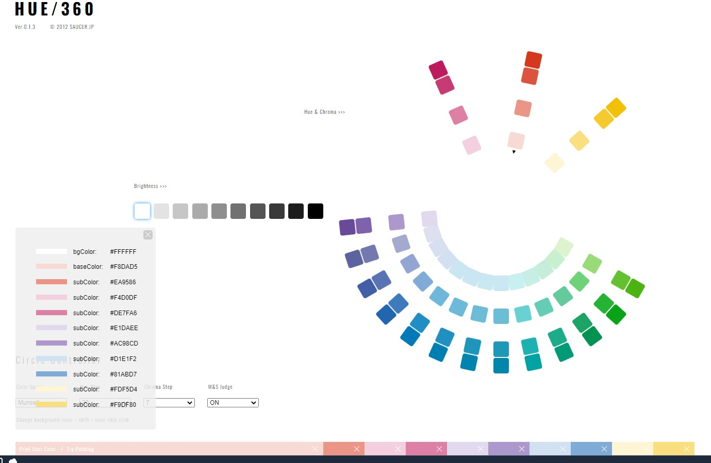

# 色

## 背景色 (変更可能性あり)

```
#FFFFFF
```

# 赤

```
#F8DAD5
#EA9586
```

## ピンク

```
#F4D0DF
#DE7FA6
```

## 紫

```
#E1DAEE
#AC98CD
```

## 青

```
#D1E1F2
#81ABD7
```

## 黄色 (現在使う予定なし)

```
#FDF5D4
#F9DF80
```


# 参考画像



http://hue360.herokuapp.com

設定: Munsell, 30, 7, ON, #FFFFFF(brightness)
BaseColor: `#F8DAD5`
